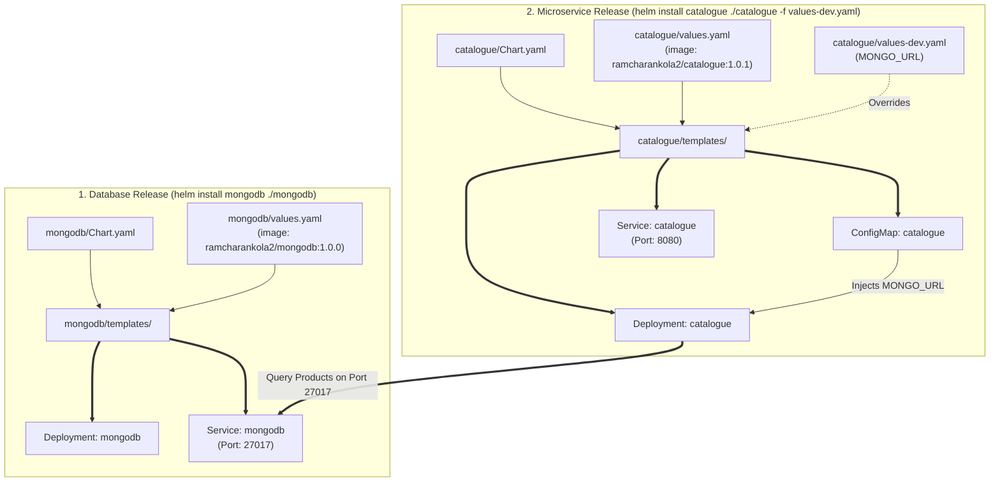

# RoboShop Microservices Helm Charts (`roboshop-helm`)

This repository contains modular, production-ready **Helm 3 Charts** for the RoboShop E-Commerce application. It includes parameterized charts for stateful database dependencies (e.g. `mongodb`) and stateless backend microservices (e.g. `catalogue`), supporting multi-environment deployments (`dev`, `prod`).

---

## 🏗️ Architecture & Helm Release Flow



---

## 📁 Repository Structure & Charts Matrix

| Chart Directory | Kind / Components | Description / Configuration |
| :--- | :--- | :--- |
| [`mongodb/`](file:///Users/sriramcharankolla/Desktop/DevOps/roboshop-helm/mongodb) | `Chart.yaml`, `values.yaml`, `Deployment`, `Service` | Standalone MongoDB database package (`ramcharankola2/mongodb:1.0.0`) on port `27017` |
| [`catalogue/`](file:///Users/sriramcharankolla/Desktop/DevOps/roboshop-helm/catalogue) | `Chart.yaml`, `values.yaml`, `values-dev.yaml`, `values-prod.yaml`, `ConfigMap`, `Deployment`, `Service` | Node.js Catalogue microservice (`ramcharankola2/catalogue:1.0.1`) on port `8080` |

---

## 🔑 Core Helm Packaging Principles

### 1. Separation of Concerns
* Each microservice is packaged as an independent, loosely coupled Helm chart.
* Databases (MongoDB) and backend microservices (Catalogue) have distinct lifecycles, enabling independent rollouts and zero-downtime updates.

### 2. Parameterization & Go Templating
* Hardcoded values are extracted into `values.yaml`:
  - `{{ .Values.deployment.replicas }}`: Dynamic replica scaling.
  - `{{ .Values.deployment.imageName }}:{{ .Values.deployment.imageVersion }}`: Dynamic Docker Hub image tagging (`ramcharankola2/*`).
  - `{{ .Values.configMap.MONGO_URL }}`: Dynamic database connection URL per environment.

### 3. Multi-Environment Value Precedence
1. `values.yaml` (Default base configuration)
2. `values-dev.yaml` / `values-prod.yaml` (Environment-specific overrides)
3. `--set` command-line flags (Ad-hoc manual overrides)

---

## 🚀 Step-by-Step Deployment & Execution Guide

### 1. Prerequisites & Namespace Setup
Ensure you are connected to your EKS cluster and create the `roboshop` namespace:
```bash
# Connect to EKS Cluster
aws eks update-kubeconfig --region us-east-1 --name roboshop-cluster

# Create namespace
kubectl create namespace roboshop

# Set roboshop as default active namespace (using kubens)
kubens roboshop
```

---

### 2. Linting & Dry-Run Validation
Always validate templates before deploying:
```bash
# 1. Lint the Helm charts
helm lint ./mongodb
helm lint ./catalogue

# 2. Render and preview generated manifests locally (offline test)
helm template mongodb ./mongodb
helm template catalogue ./catalogue -f ./catalogue/values-dev.yaml

# 3. Dry-run install against live cluster API
helm install mongodb ./mongodb -n roboshop --dry-run --debug
helm install catalogue ./catalogue -f ./catalogue/values-dev.yaml -n roboshop --dry-run --debug
```

---

### 3. Deploying RoboShop Releases

```bash
# Step 1: Deploy MongoDB Database Release
helm install mongodb ./mongodb -n roboshop

# Verify MongoDB Pod and Service:
kubectl get pods,svc -n roboshop -l component=mongodb

# Step 2: Deploy Catalogue Microservice Release (Dev Environment)
helm install catalogue ./catalogue -f ./catalogue/values-dev.yaml -n roboshop

# Verify Catalogue Pod and Service:
kubectl get pods,svc -n roboshop -l component=catalogue
```

---

### 4. Upgrading Releases & Rolling Updates

```bash
# Upgrade image tag or replica count dynamically:
helm upgrade catalogue ./catalogue \
  -f ./catalogue/values-dev.yaml \
  --set deployment.imageVersion=1.0.1 \
  -n roboshop

# View release history & revision numbers:
helm history catalogue -n roboshop
```

---

### 5. Instant Rollback

```bash
# If Revision 2 fails or is unhealthy, rollback to Revision 1:
helm rollback catalogue 1 -n roboshop

# Monitor rollback status:
kubectl rollout status deployment/catalogue -n roboshop
```

---

## 🛠️ Troubleshooting & Debugging Guide

### 1. Error: `dial tcp ... connection refused`
* **Cause:** `kubectl` / `helm` cannot reach the cluster API server.
* **Fix:**
  ```bash
  aws eks update-kubeconfig --region us-east-1 --name roboshop-cluster
  kubectl cluster-info
  ```

### 2. Pod Stuck in `CrashLoopBackOff` or `ImagePullBackOff`
* **Investigation:**
  ```bash
  # Check Pod status and events
  kubectl describe pod -l component=catalogue -n roboshop

  # Inspect container logs
  kubectl logs -f -l component=catalogue -n roboshop
  ```
* **Fix:** Ensure image repository `ramcharankola2/catalogue:1.0.1` exists on Docker Hub and is public or imagePullSecrets are configured.

### 3. Inspecting Helm Releases on Cluster
```bash
# List all releases in the roboshop namespace
helm list -n roboshop

# View user-supplied values for a release
helm get values catalogue -n roboshop

# View complete rendered manifest currently running in the cluster
helm get manifest catalogue -n roboshop
```

---

## 🧹 Safe Teardown & Resource Cleanup

> [!WARNING]
> Running `helm uninstall` gracefully terminates deployments, services, and configmaps.

```bash
# 1. Uninstall Catalogue microservice release
helm uninstall catalogue -n roboshop

# 2. Uninstall MongoDB database release
helm uninstall mongodb -n roboshop

# 3. Verify namespace is clean
kubectl get all -n roboshop

# 4. Optional: Delete the namespace
kubectl delete namespace roboshop
```
